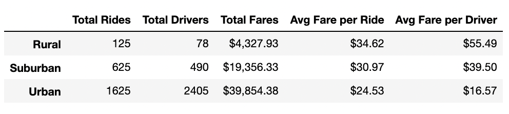
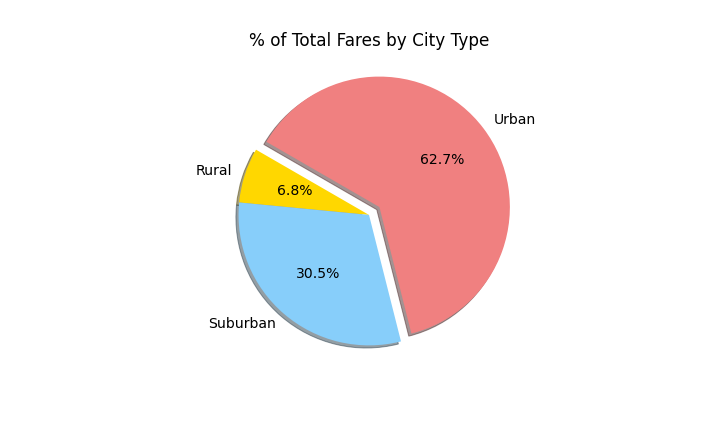
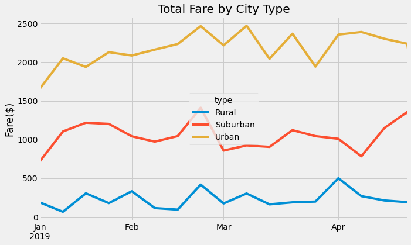

# PyBer_Analysis

## Project Overview
This analysis looks into the data from a Ride-Sharing company. The data is then cleaned, organized and visualized to better understand and make informed descisions for the company going forward. The PyBer Challenge analysis shows the total weekly fares for each city type (Urban, Suburban, Rural) for the first quarter(Q1) of the year(2019).

## Results
 

The data shows roughly 80% of the total drivers operate on Urban Cities and they bring 60% of the total revenue. The Average Fare goes up roughly $5 as you go from Urban to Rural cities. Drivers from rural city types earn the most per ride, followed by drivers from suburban cities. 

 

## Summary
Based on the results these are some recommendations for the future:
- Adding more drivers to Rural and suburban cities could see increase in revenue for the following quarters. As the data shows Rural and Suburban cities bring in roughly 40% of the total revenue while only having ~20% of the total drivers. 
 
- While increasing the drivers in Rural and Suburban areas a timed discount of 5% to 15% per ride could incentivize new and existing customers to use the service more and help the transition of new drivers by creating more demand. 

- For Urban cities increasing the driver count in general could help bring in more revenue as Urban cities have the most demand for rides. 
